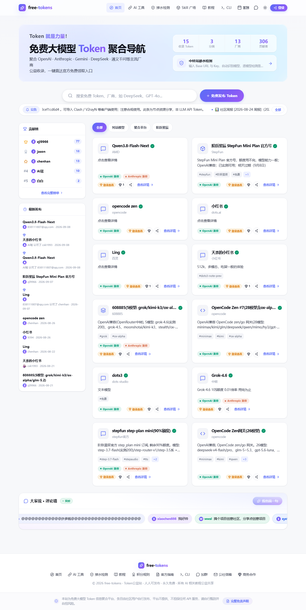

# free-tokens

<p align="center">
  <a href="https://free-tokens.org"></a>
  <br>
  <em>https://free-tokens.org · https://freeapis.top — 欢迎中转站广告合作，推荐更合适的内容而非硬广</em>
</p>

<p align="center">
  <a href="https://free-tokens.org"></a>
  <a href="https://freeapis.top"></a>
  =18">
  
  
  
</p>

> **Token 公益站**
> 免费大模型 Token 信息聚合公益平台
> 品牌 **free-tokens** · 生产环境 https://free-tokens.org 和 https://freeapis.top
> 核心口号：**Token 就是力量**。开源精神 / Copyleft（免费 + 自由）
> 纯信息聚合，不卖 Key，不做中转，不搞会员，不转售牟利

## 站点预览

<p align="center">
  
  <br>
  <em>https://free-tokens.org · https://freeapis.top（双域名同时可访问）</em>
</p>

> **欢迎中转站广告合作**：站内 `/cooperate` 自助提交，单槽位单活，创作者收益 0% 抽成。我们推荐更合适的内容，而非硬广。演示如上（聚合 OpenAI / Anthropic / Gemini / DeepSeek 等，一键直达）

## 目录

- [在线体验](#在线体验)
- [特性](#特性)
- [快速开始](#快速开始)
- [CLI 一键接入](#cli-一键接入)
- [Web 功能导览](#web-功能导览)
- [API 概览](#api-概览)
- [积分规则](#积分规则)
- [项目结构](#项目结构)
- [技术栈](#技术栈)
- [测试](#测试)
- [部署](#部署)
- [文档导航](#文档导航)
- [宣传物料](#宣传物料)
- [贡献指南](#贡献指南)
- [开源精神](#开源精神)

## 在线体验

| 入口 | 地址 | 说明 |
|------|------|------|
| 主站 | **https://free-tokens.org** | SEO 主域，canonical / sitemap 统一指向 |
| 备用 | **https://freeapis.top** | 同一应用，海报/二维码跟随当前域 |
| CLI 下载 | `https://freeapis.top/download/freeapis-cli-0.23.0.tgz` | `npm install -g` 全自包含 |

## 特性

- **每条都实测** — 发布带 Token 时对 `base_url` 做真实有效性探测（OpenAI/Anthropic 双兼容自动识别），不通过拒绝；发布即上线
- **失效自动清理** — 定时巡检（默认 6h，`SWEEP_INTERVAL_HOURS`）+ 每日 00:00，明确失效（401/403/404/503/连接失败）自动下线，429 限流视为有效
- **众创** — 人人可发布（Token 免审即公开），AI 教程走版主审核；`发布即得积分`
- **积分闭环** — `POINTS.md` / `/points` 详述：注册 +5，看卡 1 分/张按卡去重，`recent` 每日 5 次免费后 1 分/条，签到/打赏/邀请/Skill 交易均入账
- **AI Agent 原生** — 全局 `freeapis-cli` 支持 `--json`、`TOKEN_API` 自托管，`AGENT.md` 即接管手册
- **社区** — 贡献榜 / 动态流（含打赏事件）/ 个人主页 `/user/:id` / Token 打赏（1 分流动）/ 详情评论 / 留言墙 / 公告 + 周报 / 头像上传 / 邀请码（微信群领取）
- **AI 工具导航 `/tools`** — 97 款主流 AI 官网直达，分类吸顶，站内有 Token 的带“免费用”角标
- **掺水检测 `/verify`** — 输入任意 Base URL + Key 自动识别协议与模型，单模型 5 维电池 + AI 判官语义复核只升不降
- **分享卡片** — `lib/og-card.js` + `@napi-rs/canvas` 动态生成 `1200×630` OG 与 `1080×1440 3:4` 高清海报，按域渲染
- **Skill 广场 `/skills`** — 社区 Skill 发布/审核/版本化 / 0% 抽成交易
- **安全** — Helmet/CSP/nonce、SSRF 内网拦截、限流、邀请码一码一用、登录锁定、Token 去重索引

## 快速开始

```bash
npm install
npm start            # http://localhost:3000
```

```bash
# 发布一条 Token（--token 必填，--url 填 API base_url）
node cli.js add --name "xxx" --url "https://xxx" --provider "xxx" --category "对话模型" \
  --token "sk-xxx" --token-type "OpenAI" --tags "GPT-4o,免费"
```

## CLI 一键接入

```bash
npm install -g https://freeapis.top/download/freeapis-cli-0.23.0.tgz
freeapis-cli ping
freeapis-cli --json login -t <已有token>   # 或 register -u xxx -p xxx -c <邀请码>
freeapis-cli list -s "gpt-4o"
freeapis-cli view <id>
freeapis-cli recent -n 5                   # 每日免费 5 次
```

全量命令与 `--json` 见 `CLAUDE.md` / `AGENT.md` / 线上 `/cli` 与 `/cli-agent.txt`。

## Web 功能导览

| 页面 | 路径 | 亮点 |
|------|------|------|
| 首页 | `/` | 搜索/分类/排序/分页、SSE 实时新卡、公告滚动、贡献榜与动态流 SSR |
| 工具导航 | `/tools` | 97 款 AI 官网、分类吸顶、免费用角标 |
| 掺水检测 | `/verify` | 端点识别 + 单模型 5 维检测 + AI 判官 |
| 教程 | `/tutorials` | Markdown + 封面上传 + B 站自适应 |
| Skill 广场 | `/skills` | 发布/审核/购买（积分，0%抽成） |
| 积分规则 | `/points` | 可视化，表格去技术码，移动端友好 |
| CLI 指南 | `/cli` | 人类/Agent 双视角 |
| 指南 | `/guide` | OpenAI/Anthropic 接入示例 |

## API 概览

| 方法 | 路径 | 鉴权 | 说明 |
|------|------|------|------|
| `GET` | `/api/health` `/api/stats` | 无 | 探活/统计 |
| `GET` | `/api/items?category=&search=&limit=&offset=` | 可选 | 列表（分页） |
| `GET` | `/api/items/:id` | 可选 | 详情（未登录锁 url/token） |
| `POST` | `/api/items` | Bearer | 发布（需真 Token） |
| `GET` | `/api/points` | Bearer | 积分余额/流水 |
| `GET` | `/api/recent?limit=N` | Bearer | 拉取最近 Key（5 免费/日） |
| `POST` | `/api/checkin` | Bearer | 每日签到（1/3/6） |

完整表见 `CLAUDE.md` 与 `server.js`。

## 积分规则

> 详见 [`POINTS.md`](./POINTS.md) 与 [`/points`](https://free-tokens.org/points)

- **得**：注册 +5、发布 Token +1、教程/ Skill/反馈过审 +1、邀请 +1、被打赏 +1、Skill 售出 +price、签到 +1（7 天+2、30 天+5）
- **耗**：看卡 1 分/张（同卡仅首扣）、`recent` 超 5 条后 1 分/条、打赏 1 分、购买 Skill 按价
- **免费**：`recent` 每天 5 条（UTC+8 自然日），版主豁免

## 项目结构

```
├── server.js              # Express + SSR 页面 + API
├── cli.js                 # CLI 单一来源
├── lib/                   # db.js / auth.js / layout.js / points.js / og-card.js / analytics.js
├── public/                # 前端（app.js / dash.js / styles.css / upload.js / md.js / checkin.js / sponsor.js）
├── data/ai-tools.js       # 工具导航策展（97 款）
├── scripts/               # build-cli-package / check
├── 宣传物料/              # 公众号长文 + 7 海报×2 尺寸
├── tests/                 # doc-consistency / api / cli / cli-e2e / playwright-*
└── .github/workflows/ci.yml
```

## 技术栈

Node.js + Express · SQLite (`better-sqlite3`, WAL) · JWT (`bcryptjs`) · `helmet`/`rate-limit` · 纯原生前端（`Lucide` + 布局工厂）· `commander` CLI · `@napi-rs/canvas` + `qrcode`

## 测试

```bash
npm run check     # 语法检查（~231 文件）
npm test          # 文档守护(11) + API(312) + CLI(11) + CLI e2e(37) = 371 项
npm run ci        # check + test
```

## 部署

纯站代码 `cp .env.example .env && npm start` 即跑，生产由维护者直连部署（`Gitea` 全量仓），贡献者无需关心服务器。

## 文档导航

| 文档 | 内容 |
|------|------|
| `AGENT.md` | 全局接管指南 |
| `CLAUDE.md` | AI 操作速查 |
| `POINTS.md` | 积分规则源码级 |
| `CONTRIBUTING.md` | 贡献指南 |
| `CHANGELOG.md` | 变更日志 |

## 宣传物料

`宣传物料/`：公众号长文 + **7 张海报 × 2 尺寸**（小红书 3:4 `1242×1656` + 方形 `1080×1080`）、配套文案、头图/OG。改后 `node scripts/gen-posters-html.js` 重生成。

## 贡献指南

1. Fork & `git clone`，`npm install`
2. 改动走分支，`npm run ci` 全绿再提 PR
3. 新增接口/页面请补 `seoCacheHtml` / `canonicalUrl` / 用例
4. CLI 发版：改 `cli.js:65` 后 `node scripts/build-cli-package.js`

## 开源精神

Linux 和 Git 是这样长出来的，我们的 Token 公社也是。**Free = 免费 + 自由**。有能力的贡献，需要的人受益——我为人人，人人为我。

<p align="center">
  <sub>© 2026 free-tokens · Token公益站 · 人人可发布 · 永久免费</sub>
</p>
